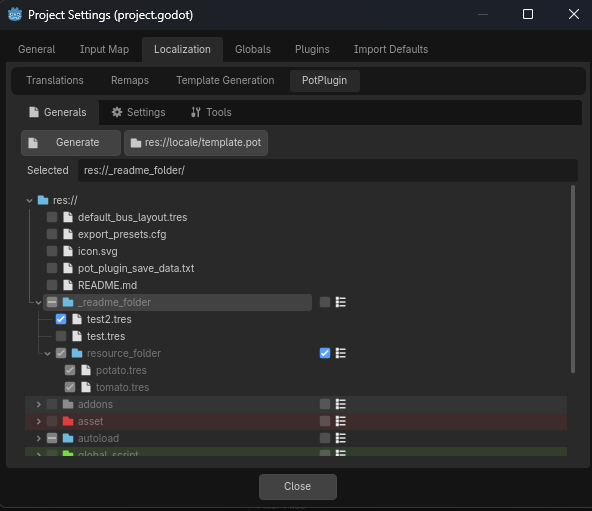
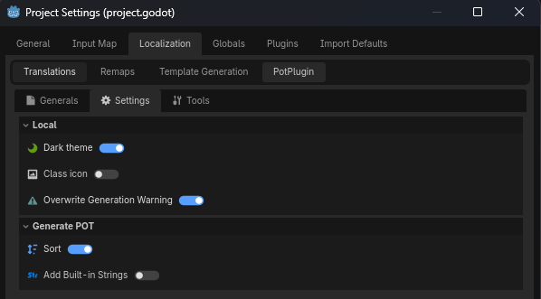
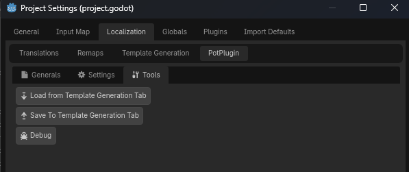

# POT Plugin
POT生成に含めるファイルをツリー状に選択できるようにするアドオンです

## 基本
プロジェクト設定>ローカライズ>PotPlugin から利用できます  
チェックが付いたファイルが生成に含まれます。  
  

## フォルダー
誤操作と後述の機能の複雑さを防ぐためフォルダーのチェックを手動操作できません  
（Godotのチェックボックスはボックス外でも項目全面に判定があります）  
代わりに右側のチェックボックスを使用してください。  

右側のチェックボックスがオンになっているフォルダーは常に子（ネスト含む）のファイルにチェックを付けます。  
（たとえばアイテムのフォルダをオンにし、自動ですべてのアイテムリソースを含ませる等）  

オフにすると中のチェックが外れます。  
（子（ネスト含む）のフォルダーに右側のチェックが付いている場合その子（ネスト含む）のチェックは外れません）  

なので間違えてオンにした場合Ctrl+Z等で戻りましょう。  

## データの場所
何のファイルを含めるかなどのセーブデータは res://pot_plugin_save_data.txt に保存されます。  
ローカルの設定データ(ダークテーマ等の個人的機能)は res://.godot/pot_plugin_local_setting.txt に保存されます。(.godot内なので基本gitignoreです)

## その他
### 設定  
  
### ツール  
  
